# 内容体系全面

话不多说，先给大家看看，手册的内容结构：

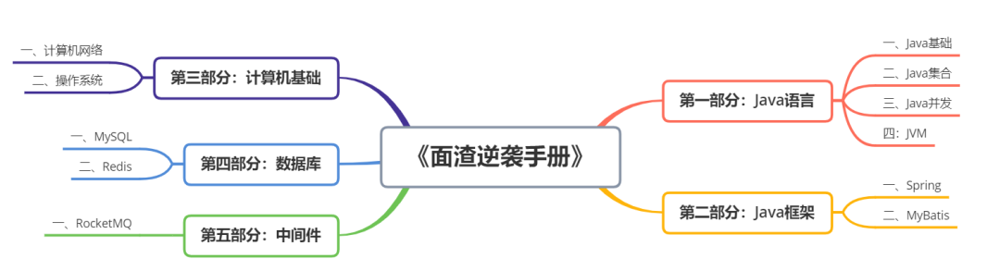

手册目前共有`Java语言`、`Java框架`、`计算机基础`、`数据库`、`中间件` 五大部分，涵盖了`Java基础`、`Java集合`、`Java并发`、`JVM`、`Spring`、`MyBatis`、`计算机网络`、`操作系统`、`MySQL`、`Redis`、`RocketMQ`、`分布式`、微服务 十三个章节，共有 1000 多页，可以说基本涵盖了面试的必问考点。

而且手册的内容不是杂乱无章的，每一部分都是循序渐进，由浅入深，看看目录就知道了：

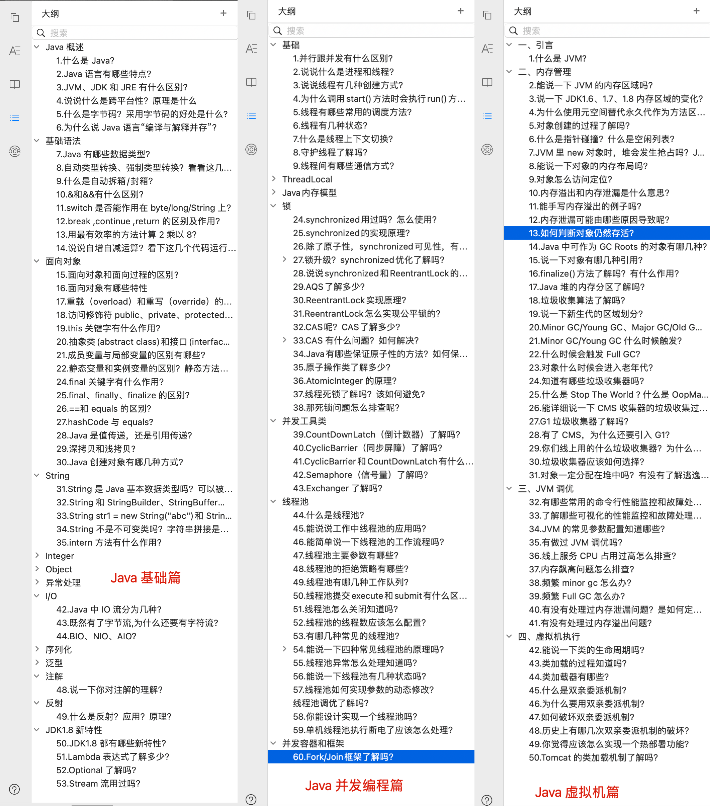

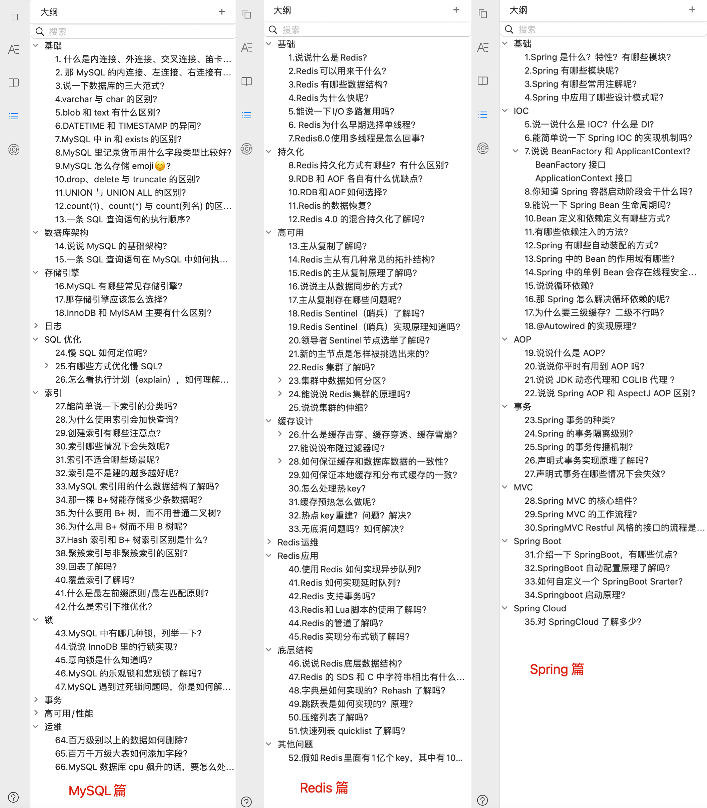

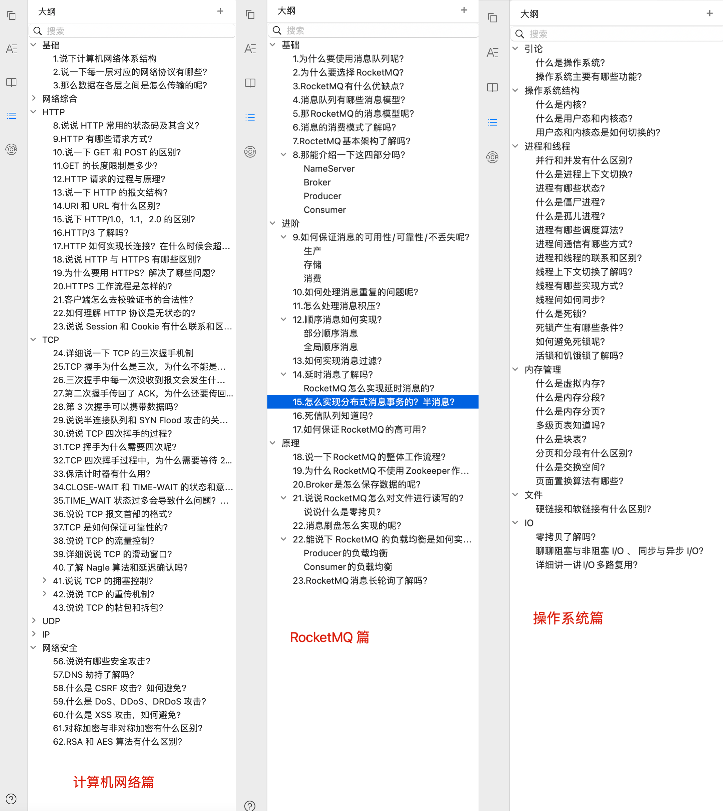

成体系的知识才是最有价值的，这本手册你不仅可以把它当做一本面试题解，还可以当作学习指南，带着这本手册里的问题，相信你学习起来也是事半功倍。

### 图文并貌，深入浅出

作者面试过很多次，也面过别人很多次，自己背八股背的时候苦哈哈，听别人背八股的时候也噎地够呛，所以作者在写面渣逆袭系列的时候，努力做到图文并茂，深入浅出，让大家带着理解去记忆面试题，带着亮点去回答面试题。

大家都知道，图比文字更好理解、更好记忆，看过作者面渣逆袭系列的朋友应该都知道，作者经常是三十问，五十图，基本上做到了图比问题多，能用图说话就使劲肝图。

比如这张HTTPS的工作流程图，足足画了一个多小时：

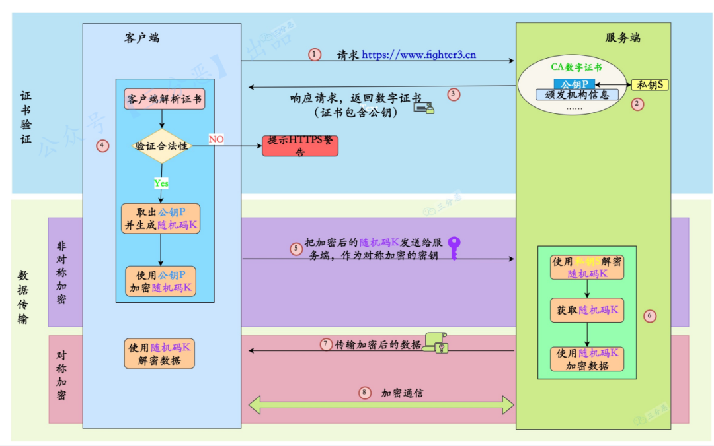

作者还喜欢用一些有意思的比喻去讲解技术，努力让枯燥的知识点变得生动起来。

比如，经典的四次挥手，很多朋友看完，直呼“满脑子都是分手”：

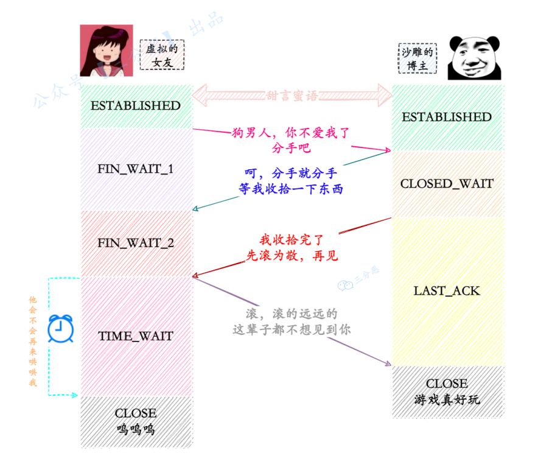

比如，作者拿人的一生，比喻Spring Bean生命周期，有人说“泪目”：

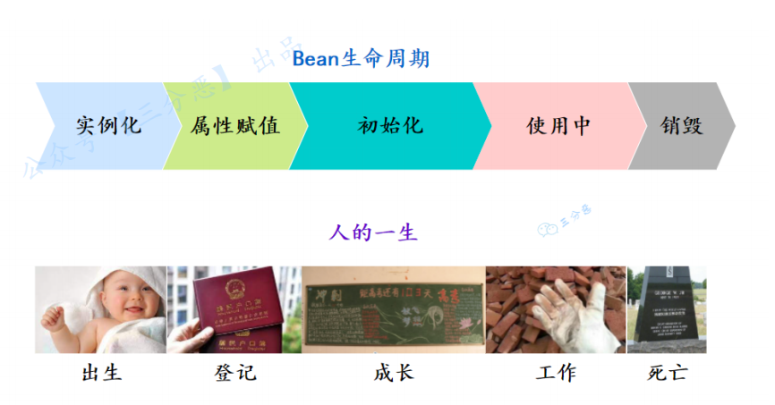

还有，直接让人有点yue，又有点兴奋，就像是拿“占着茅坑不拉屎”，“憋急了没坑位”来比喻内存泄露和内存溢出：

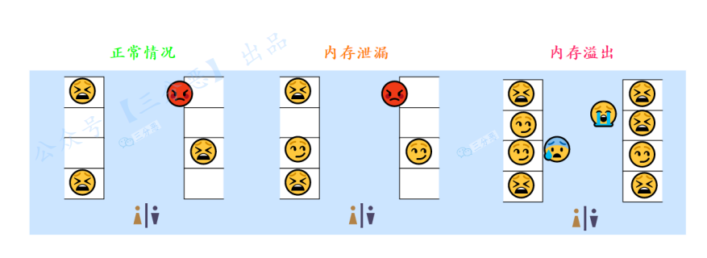

……

这样的例子还有很多，打开手册，你可以慢慢去发现。

### 持续迭代，不断完善

这本册子目前的版本是1.0，也就意味着，它还有1.1、2.0、3.0……

这本册子不是一揽子买卖，而是像一个产品一样，既持续修复bug、优化体验，又不断迭代新功能。

作者会持续维护和更新这个册子，包括：

*   “迭代新的功能”——分布式、微服务、Dubbo、Elasticsearch、数据结构与算法、系统设计……
*   “修复现有的小Bug”——随时接受大家的反馈，精益求精，不断打磨内容……
*   “优化用户体验”——优化答案、添加更多图解，后续还会推出在线版……

* * *

## 在线版阅读

有些朋友喜欢在线版阅读，所以这里也安排上了。

>**面试前必读系列**！硬核理解版八股文，包括 Java 基础（JavaSE）、Java 集合框架、Java 并发编程（Java 多线程）、Java 虚拟机（JVM）、Spring、MySQL、Redis、MyBatis、操作系统、计算机网络、RocketMQ、分布式等等，助你拿到心仪 offer！

- [面渣逆袭（Java 基础篇面试题八股文）必看👍](/sidebar/sanfene/javase.md)
- [面渣逆袭（Java 集合框架篇面试题八股文）必看👍](/sidebar/sanfene/collection.md)
- [面渣逆袭（Java 并发编程篇面试题八股文）必看👍](/sidebar/sanfene/javathread.md)
- [面渣逆袭（Java 虚拟机篇面试题八股文）必看👍](/sidebar/sanfene/jvm.md)
- [面渣逆袭（Spring面试题八股文）必看👍](/sidebar/sanfene/spring.md)
- [面渣逆袭（MySQL面试题八股文）必看👍](/sidebar/sanfene/mysql.md)
- [面渣逆袭（Redis面试题八股文）必看👍](/sidebar/sanfene/redis.md)
- [面渣逆袭（MyBatis面试题八股文）必看👍](/sidebar/sanfene/mybatis.md)
- [面渣逆袭（操作系统面试题八股文）必看👍](/sidebar/sanfene/os.md)
- [面渣逆袭（计算机网络面试题八股文）必看👍](/sidebar/sanfene/network.md)
- [面渣逆袭（RocketMQ面试题八股文）必看👍](/sidebar/sanfene/rocketmq.md)
- [面渣逆袭（分布式面试题八股文）必看👍](/sidebar/sanfene/fenbushi.md)
- - [面渣逆袭（微服务面试题八股文）必看👍](/sidebar/sanfene/weifuwu.md)

## PDF版阅读

有些朋友喜欢打印或者阅读 PDF 版本，这里也安排上了。先带大家预览一下这本册子：

*   Java基础

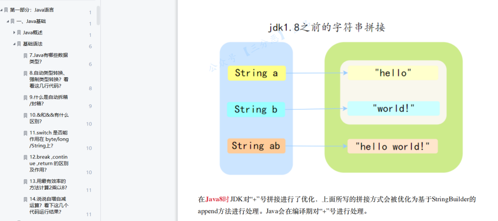

*   Java集合

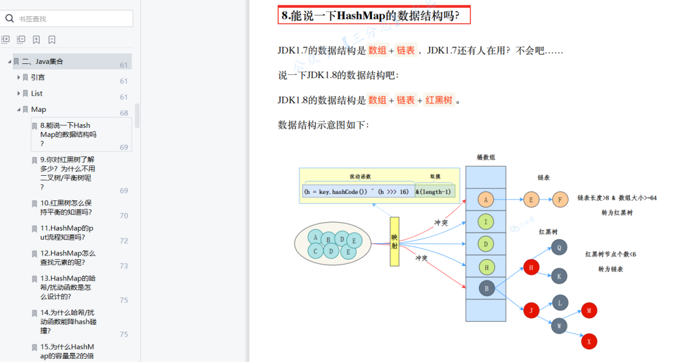

*   Java并发

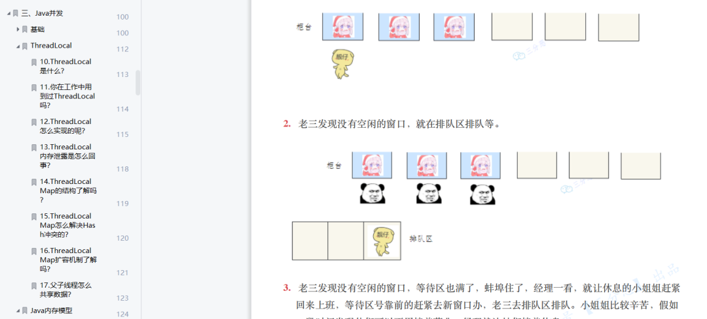

*   JVM

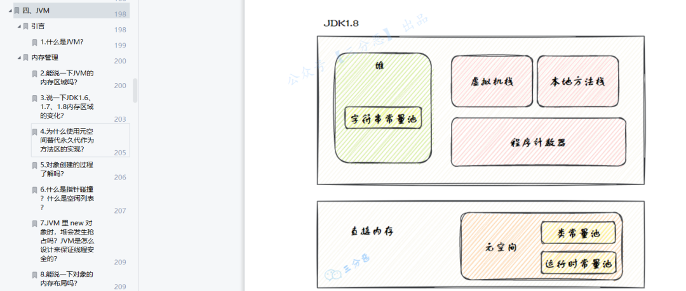

*   Spring

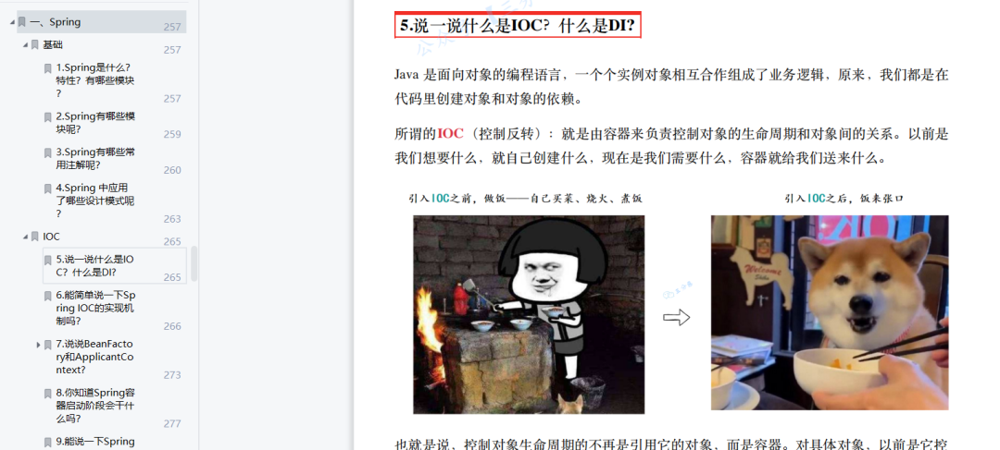

*   MyBatis

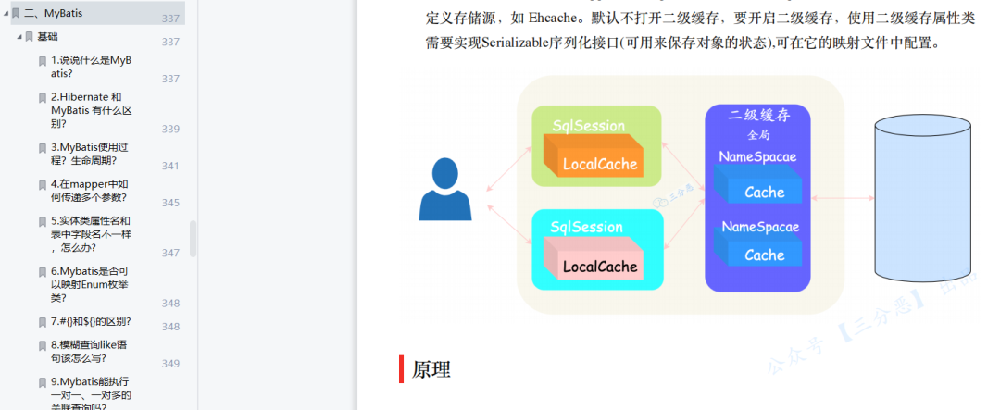

*   计算机网络

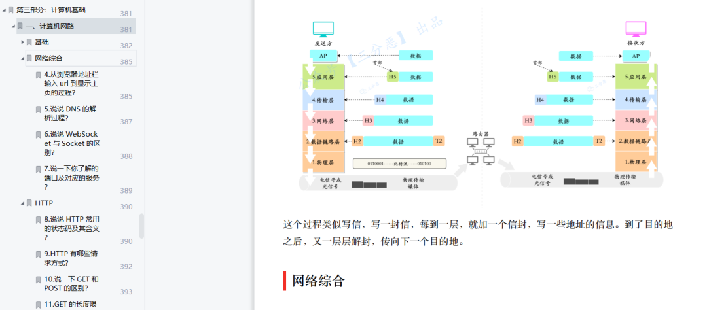

*   操作系统

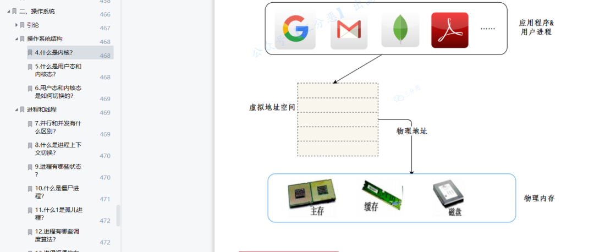

*   MySQL

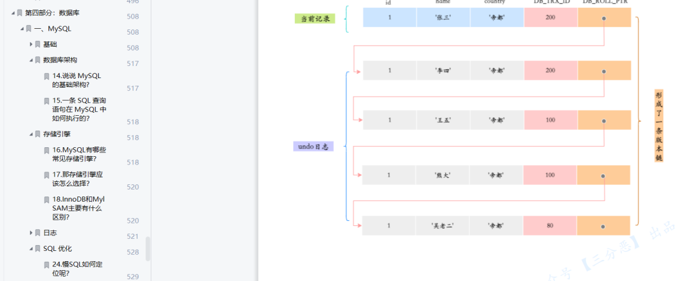

*   Redis

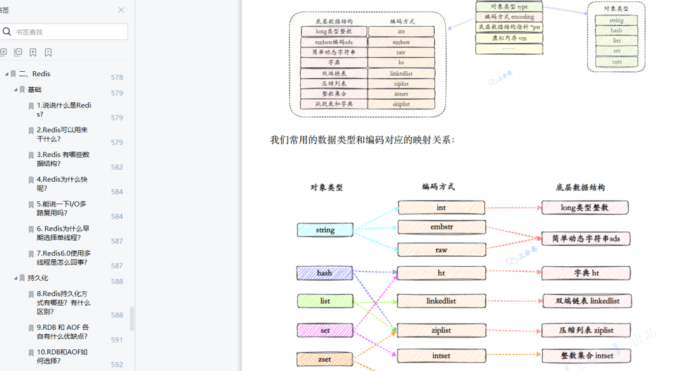

*   RocketMQ

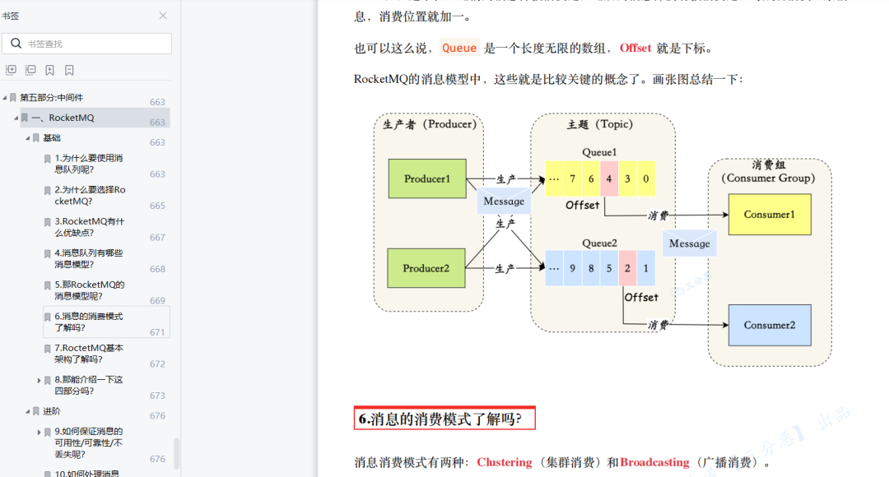

* 分布式

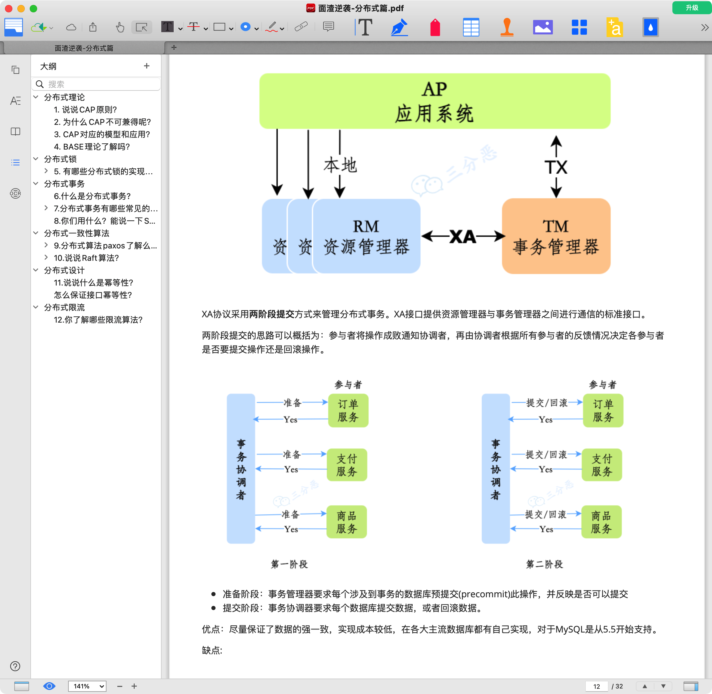

* 微服务

